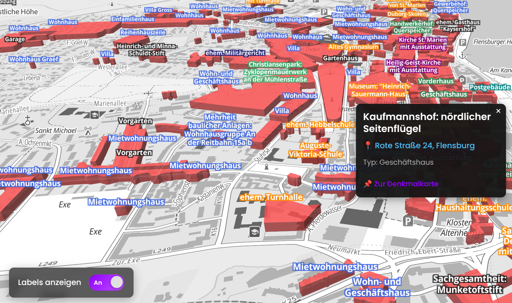

# 3D Monument Map - Flensburg

View the live map: [Flensburg 3D Monument Map](https://tifa365.github.io/karte_3d_denkmaeler_flensburg/)

## Project Overview

This project builds upon the excellent foundation created by Thomas Tursics during the International Open Data Day 2025 in Flensburg. Special thanks to him for establishing the initial map implementation and data processing workflow that made this enhanced version possible. You can find his repository [here](https://github.com/tursics/opendataday2025).

## Original Implementation

The original project utilizes MapLibre GL JS to create an interactive 3D map of Flensburg's monuments using open data from Schleswig-Holstein. The data required projection conversion from UTM 32 to WGS 84 and was filtered to focus specifically on Flensburg monuments.

## Enhanced Features

This version expands on the original work with significant improvements:

- **Building Labels with Type Categorization**: Color-coded labels clearly identify different monument types
- **Interactive Label Controls**: Elegant toggle interface for showing/hiding building labels
- **Smooth Loading Animation**: Visual feedback during data processing
- **Rich Information Popups**: Detailed monument information available on click
- **External Resource Integration**: 
  - Direct links to official Denkmalkarte entries for each monument
  - OpenStreetMap integration for additional context
- **Mobile-Optimized Interface**: Repositioned controls for better usability on smaller screens

## Data Sources

- Monument data: Schleswig-Holstein Open Data Portal
- Base map: Basemap.de vector tiles